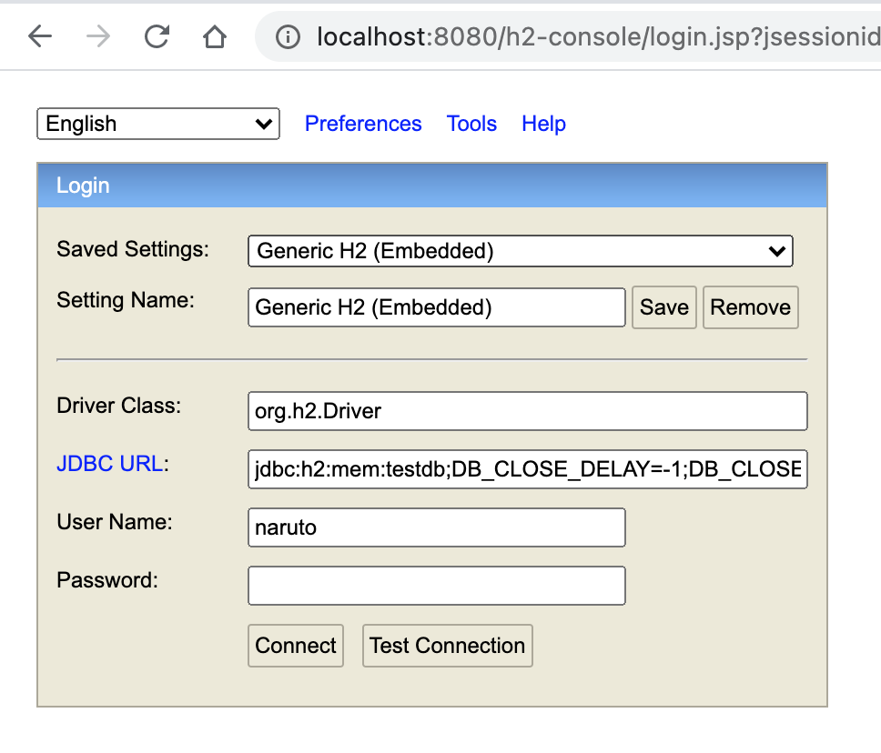
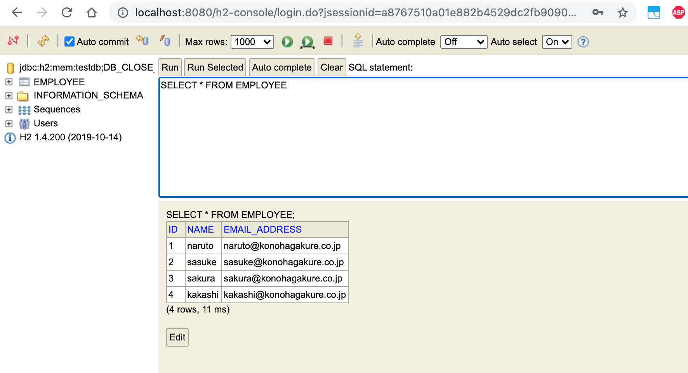

# springboot-angular-file-download

### Things todo list:

1. Clone this repository: `git clone https://github.com/hendisantika/springboot-angular-file-download.git`
2. Navigate to the folder: `cd springboot-angular-file-download`
3. Run the application: `gradle clean bootRun --info`
4. Open your favorite browser:

* Get All Employee List: http://localhost:8080/employees
  ```json
    / 20210525050019
    // http://localhost:8080/employees
    
    [
    {
    "id": 1,
    "name": "naruto",
    "email": "naruto@konohagakure.co.jp"
    },
    {
    "id": 2,
    "name": "sasuke",
    "email": "sasuke@konohagakure.co.jp"
    },
    {
    "id": 3,
    "name": "sakura",
    "email": "sakura@konohagakure.co.jp"
    },
    {
    "id": 4,
    "name": "kakashi",
    "email": "kakashi@konohagakure.co.jp"
    }
    ]
    ```
* Download All Employee List: http://localhost:8080/employees/download

### Images Screen shot

H2 Console



H2 Employee List



Employee List


